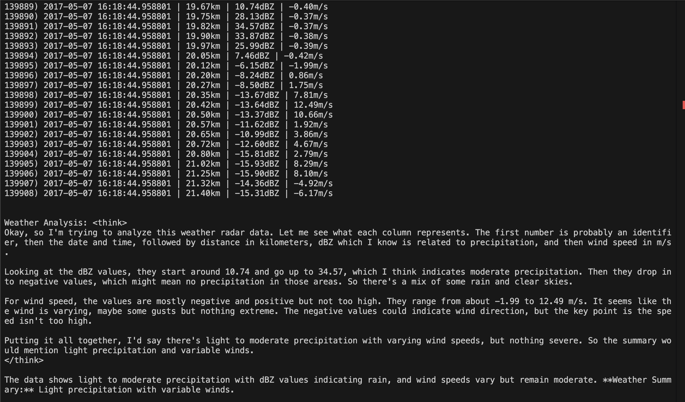

# AI x Geoengineering Hackathon at AGI House: AI Weather Prediction with NASA Satellite Data

This project employs NASA's Cloud Radar System (CRS) data to analyze weather patterns using DeepSeek. The CRS, a 94 GHz, W-band polarimetric Doppler radar onboard the ER-2 high-altitude research aircraft, provides radar reflectivity and Doppler velocity measurements.

## How It Works

1. **Data Collection** : CRS captures radar reflectivity and Doppler velocity at altitudes around 12 miles.
2. **Data Processing** : A Python routine processes the radar data to generate time-height plots.
3. **Analysis** : DeepSeek analyzes these plots to predict the weather.

**Understanding Radar Reflectivity and Doppler Velocity**

* **Radar Reflectivity** : This measures the amount of transmitted radar power returned to the receiver after hitting precipitation particles like raindrops or snowflakes. Higher reflectivity indicates more intense precipitation.
* **Doppler Velocity** : This measures the speed at which precipitation particles are moving toward or away from the radar. By analyzing the frequency shift of the returned radar signal (the Doppler effect), we can determine the motion of these particles.

